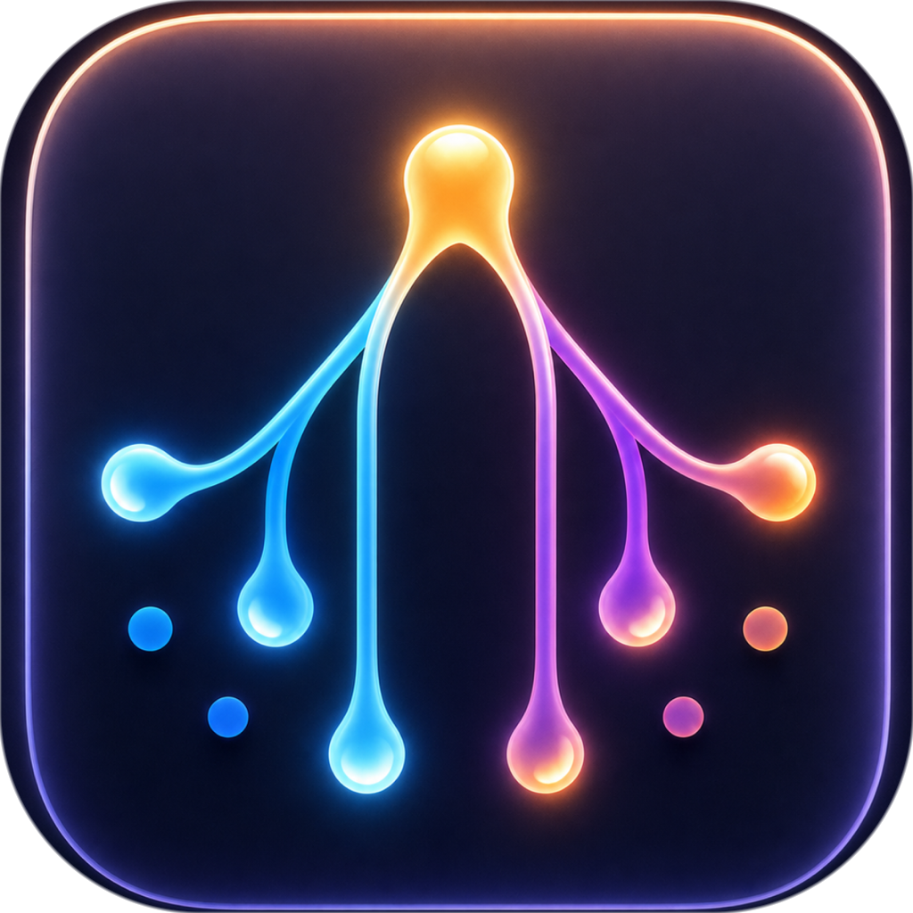
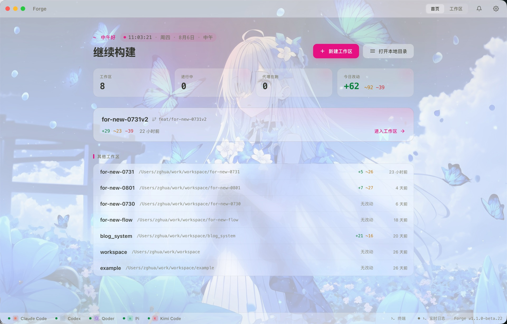
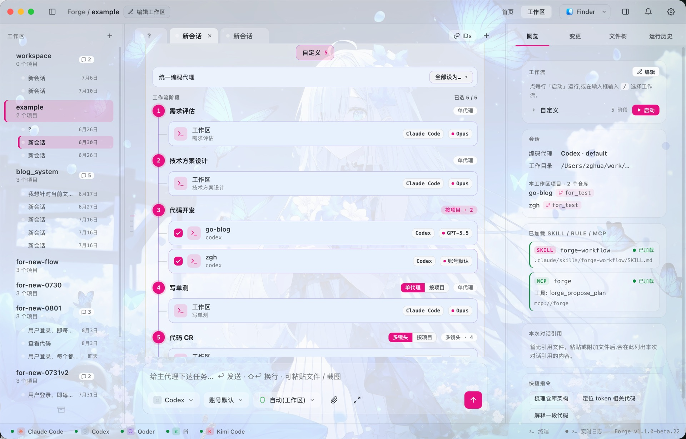

<div align="center">



# myFlowForge

**Ein macOS-Cockpit für deine KI-Coding-Agenten.**

Ein macOS-Desktop, der **Claude Code, Codex, Cursor, Gemini, qoder, opencode, Trae** und weitere an einem Ort versammelt —— damit du **mitten im Gespräch Agent und Modell wechseln**, **mehrere Projekte parallel entwickeln**, die Arbeit mit einem **leichtgewichtigen Workflow im Handschaltmodus** führen und eigene **Hooks** zwischen die Stufen einflechten kannst.

[](LICENSE)


[English](README.md) · [简体中文](README.zh-CN.md) · [日本語](README.ja.md) · [한국어](README.ko.md) · [Español](README.es.md) · [Français](README.fr.md) · **Deutsch**

</div>

---

<div align="center">



<sub><b>Startseite</b> — mach da weiter, wo du aufgehört hast. Hintergrundbild, Skin und Akzentfarbe sind frei wählbar.</sub>

</div>

---

## Was ist myFlowForge?

Jedes KI-Coding-CLI lebt in seinem eigenen Terminal, mit eigenem Sitzungszustand, eigenem Kontingent und ohne die geringste Ahnung, dass es die anderen gibt. Du wählst eines aus und bleibst für den Rest der Aufgabe daran gebunden.

**myFlowForge holt sie alle unter ein Dach.** Agent und Modell sind Eigenschaften *jedes einzelnen Zugs*, nicht der Sitzung: Denk einen Entwurf mit Claude Opus durch, gib die Umsetzung an Codex weiter und schalte für die Aufräumarbeiten auf etwas Günstiges — alles innerhalb eines Gesprächs, mit intaktem Kontext.

Darüber liegt ein **leichtgewichtiger Workflow**: kein Fließband, das dir davonläuft, sondern eine dünne Schicht Struktur über demselben Gespräch. Jede Stufe wartet, bis du *Weiter* drückst.

> ⚠️ **Projektstatus:** ein aktiv entwickeltes persönliches Projekt. Zielplattform ist **macOS** (Apple Silicon und Intel). Da es auf Electron basiert, lässt es sich aus dem Quellcode für andere Plattformen bauen, paketiert wird derzeit aber nur macOS. **1.1.0** ist die aktuelle stabile Version; die Betas zwischen zwei stabilen Versionen sind der Ort, an dem Neuerungen zuerst landen.

## ✨ Die fünf Dinge, um die es wirklich geht

### 1. Eine Sammlung von Agenten, kein Liebling

Zwölf Coding-CLIs koexistieren in einer Oberfläche: **Claude Code · Codex · Cursor · Gemini · qoder · opencode · Qwen · Copilot · Pi · Kimi · Reasonix · Trae**.

Die Modelllisten werden **aus der echten lokalen Konfiguration jedes CLI gelesen** — nichts ist fest verdrahtet, du siehst also genau das, was dein Konto tatsächlich ausführen kann. Eigene Einträge lassen sich von Hand ergänzen und überleben die nächste Aktualisierung. **opencode** ist selbst ein Multi-Anbieter-Gateway: einmal anbinden, viele erreichen.

### 2. Agent und Modell innerhalb einer Sitzung wechseln

Agent, Modell und Berechtigungsmodus sind drei Auswahlfelder, die ständig unter dem Eingabefeld sitzen. Ändere sie vor deiner nächsten Nachricht:

- Ein Modell hakt oder driftet ab → wechseln und weiterfragen; es sieht das bisherige Gespräch.
- Kontingent bei einem Anbieter aufgebraucht → zu einem anderen wechseln, dieselbe Sitzung.
- Teures Modell zum Nachdenken, günstiges für die Fleißarbeit.

Agenten mit nativer Fortsetzung (Claude Code, Codex, Cursor, qoder, opencode) knüpfen an ihren eigenen Sitzungsverlauf an. Für die übrigen rekonstruiert myFlowForge den Kontext. So oder so redest du einfach weiter.

### 3. Mehrere Projekte gleichzeitig entwickeln

Ein Arbeitsbereich fasst **mehrere Repositories**. Eine Stufe kann sich *pro Projekt auffächern*: Frontend, Backend und SDK kommen gleichzeitig voran, jeweils von einem eigenen Agenten in einem eigenen **git worktree** getrieben, sodass sie sich nie in die Quere kommen — und alle Diffs landen zur Durchsicht in einem gemeinsamen Änderungen-Panel.

Die Auffächerung nimmt auch eine Teilmenge: alle fünf Repositories analysieren, aber nur in zweien Code schreiben, ist eine völlig normale Konfiguration.

### 4. Ein leichtgewichtiger Workflow — im Handschaltmodus

Einen Workflow zu starten lässt ihn **nicht** bis zum Ende durchlaufen. Er geht in einen Gesprächsmodus über:

- Ein Band oben zeigt *Schritt N von M · aktuelle Stufe · welcher Agent gerade fährt*.
- Der Agent dieser Stufe arbeitet **im Chat direkt vor dir** — Ausgabe, Werkzeugaufrufe und Dateischreibvorgänge sind alle sichtbar.
- Nicht zufrieden? Rede einfach weiter. Nachfragen und Korrekturen führen die Stufe nicht erneut aus.
- Zufrieden? Drück **Weiter**. Erst dann wird die Übergabe geschrieben und der nächste Agent hinzugezogen.

Die Entwurfsstufe schreibt ein **echtes Markdown-Dokument** (`forge-docs/design.md`), gegliedert nach Projekten. Dieses Dokument — und keine verlustbehaftete Zusammenfassung — ist der einzige Vertrag zwischen den Agenten; nachgelagerte Agenten lesen es vollständig und konzentrieren sich dann auf ihren eigenen Abschnitt.

Stufen mit Freigabetor halten an und warten auf dich: **freigeben**, **zurückweisen** (deine Anmerkungen werden oben angeheftet, die vorherige Ausgabe kommt als Grundlage zurück) oder einfach **nachfragen**, ohne einen erneuten Durchlauf auszulösen. Erst spät gemerkt, dass der Entwurf falsch war? Spring zu einer früheren Stufe zurück und mach sie neu.

### 5. Hooks zwischen den Stufen

Ein Hook ist ein kleiner Schritt, der **zwischen** zwei Stufen eingeschoben wird. Wo eine Stufe ein Agent ist, der echte Entwicklungsarbeit leistet, ist ein Hook eine Besorgung, die nebenbei erledigt wird.

Häng einen **vor den Durchlauf**, **hinter eine beliebige Stufe** oder **hinter den gesamten Durchlauf**: den neuesten Code holen, das Entwurfsdokument ins Wiki spiegeln, den Linter laufen lassen, ein Board aktualisieren, eine Benachrichtigung schicken.

Jeder Hook läuft als **eingeschränkter Mikro-Agent** im Wurzelverzeichnis des Arbeitsbereichs — nur mit den Skills und Werkzeugen, die er bekommen hat, plus der aktuellen Aufgabe und den vorgelagert erzeugten Artefakten. Er meldet sich in einem Satz zurück und fragt dich direkt, wenn er auf etwas stößt, das nur ein Mensch klären kann. Ein Fehlschlag **blockiert** die Pipeline und bietet Wiederholen / Überspringen / Abbrechen an. Hooks liegen in einer globalen Bibliothek, unabhängig von jedem Steckplatz: einmal schreiben, überall anhängen.

---

<div align="center">



<sub><b>Stufenaufbau</b> — fünf Stufen, jede mit eigenem Agenten und Modell; <i>Entwicklung</i> fächert sich über zwei Repositories auf.</sub>

</div>

---

## 🤖 Unterstützte Coding-Agenten

| Agent | Chat | Workflow | Native Fortsetzung | MCP | Modelle |
|-------|:----:|:--------:|:------------------:|:---:|---------|
| **Claude Code** | ✅ | ✅ | ✅ | ✅ | aus dem CLI ermittelt |
| **Codex** | ✅ | ✅ | ✅ | ✅ | aus dem CLI ermittelt |
| **Cursor** | ✅ | ✅ | ✅ | ✅ | aus dem CLI ermittelt |
| **qoder** | ✅ | ✅ | ✅ | ✅ | ermittelt + eigene Liste |
| **opencode** | ✅ | ✅ | ✅ | ✅ | Multi-Anbieter-Gateway |
| **Gemini** | ✅ | ✅ | — | ✅ | vordefinierte Liste |
| **Qwen** | ✅ | ✅ | — | ✅ | vordefinierte Liste |
| **Copilot** | ✅ | ✅ | — | ✅ | vordefinierte Liste |
| **Pi** | ✅ | ✅ | — | — | Kontostandard / eigene |
| **Kimi** | ✅ | ✅ | — | — | kimi-k2.5 · 256K |
| **Reasonix** | ✅ | ✅ | — | — | deepseek-flash / reasoner |
| **Trae** 🆕 | ✅ | ✅ | — | — | Kontostandard (`/model` oder `trae_cli.yaml`) |

> **Trae** (das TraeCode CLI von ByteDance) wird nicht über npm verteilt: Sein offizielles `install.sh` legt `traecli` nach `~/.local/bin`, achte also darauf, dass das im PATH liegt. Damit es innerhalb eines Workflows unbeaufsichtigt Dateien bearbeitet, führe `traecli config edit` aus und setze `permission_mode: bypass_permissions`.

myFlowForge **speichert keine API-Schlüssel und leitet keine Anfragen weiter** — es steuert die CLIs, die auf deinem Rechner bereits installiert und angemeldet sind. Was fehlt, wird in den Einstellungen samt Installationshinweis angezeigt.

## 🔧 Wie ein Durchlauf aussieht

```
   Du beschreibst das Ziel
            │
            ▼
  ┌─ hook ─┐        ┌─ hook ─┐                    ┌─ hook ─┐
  │  vor   │        │  nach  │                    │  nach  │
  │  dem   │        │  dem   │                    │  dem   │
  │ Lauf   │        │Entwurf │                    │ Ganzen │
  └───┬────┘        └───┬────┘                    └───┬────┘
      ▼                 ▼                             ▼
 📋 Anforderung → 🎨 Entwurf → ✋ TOR → 💻 Entwicklung → 🧪 Tests → 🔍 Review
   (klären)      (design.md)  du entscheidest (aufgefächert) (prüfen) (mehrperspektivisch)
                      │                    │
                      │                    └─ ein Agent pro Projekt,
                      │                       parallele Spuren, eigener worktree
                      └─ ein echtes Dokument, von jedem nachgelagerten Agenten
                         vollständig gelesen

 Jeder Pfeil wartet, bis du „Weiter" drückst. Stufen lassen sich hinzufügen,
 entfernen, umsortieren oder überspringen — nur Anforderung → Entwicklung
 zu fahren ist völlig legitim.
```

Drei Wege, einen zu starten, die alle am selben Tor münden:

1. Im Workflow-Panel auf **Start** drücken.
2. `/` ins Eingabefeld tippen und einen auswählen.
3. Eine vollständige Entwicklungsaufgabe in normaler Sprache beschreiben — der Hauptagent erkennt sie und öffnet über MCP ein Freigabetor für den Plan. Bloße Fragen, Diskussionen und Einzeiler-Korrekturen lösen es nicht aus.

## 🧩 Außerdem mit dabei

- **Import nativer Sitzungen** — schreibgeschützter Scan deines lokalen Verlaufs von Claude / Codex / Cursor / qoder; als Arbeitsbereich importieren und weitermachen.
- **MCP-Brücke** — ein eingebauter Forge-MCP-Server lässt Agenten in die App zurückrufen: `forge_ask`, `forge_propose_plan`, `forge_write_artifact`, `forge_handoff`, `forge_delegate`, `forge_read_context`, `forge_heartbeat`. Wird in die acht MCP-fähigen Agenten injiziert; die übrigen fallen auf eine Textanweisung zurück.
- **Beobachtbarkeit in Echtzeit** — Denken, Werkzeugaufrufe, Dateiänderungen und Rohausgabe im Stream; filterbare Log-Konsole, Laufhistorie und projektübergreifende Änderungsbelege.
- **Token-Verbrauch und Kontingent** — verbleibendes Kontingent und Reset-Zeitpunkt je Anbieter, dazu der Verbrauch nach Arbeitsbereich × Agent × Tag.
- **Bot-Brücke** — Tore beantworten, Ergebnisse ansehen, ein Gespräch starten und Workflows steuern, per **DingTalk** am Telefon (Telegram / Feishu sind für später bereits verdrahtet).
- **Berechtigungsmodi** — nur lesen · automatisch im Arbeitsbereich (Standard) · Vollzugriff, je Sitzung oder je Stufe. Sie bilden den echten Sandbox-Umfang jedes CLI ab, und die Oberfläche sagt klar, welche Agenten sich tatsächlich daran halten.
- **Slash-Befehle, Skills und Plugins** — `/` blendet deine real vorhandenen Befehle und installierten Skills ein, gefiltert je Agent.
- **Eigene Workflows** — den Ablauf stellst du selbst zusammen: Speichere beliebig viele benannte Workflows mit jeweils eigenem Stufensatz; jede Stufe wählt Agent, Modell, Berechtigungsmodus, Auffächerungsform, ob sie ein Tor setzt und ob sie ein Dokument liefern muss.
- **Eigene Stufen** — eine globale Bibliothek selbst geschriebener Stufen, aus jedem Workflow referenzierbar.
- **Dateibrowser und Diff** — Vollbild-Baum mit Änderungsmarkierungen, Vorschau mit Syntaxhervorhebung, Umschalter Diff / Volltext.
- **Eingebautes Terminal** — ein echtes pty im Arbeitsbereich verwurzelt, mit Proxy- und Zeitzoneneinstellung je Anbieter.
- **Desktop-Haustier** — folgt dem fokussierten Bildschirm, zeigt eine Vorschau der Agentenaktivität und blendet Bestätigungskarten ein; stöbere im Haustier-Markt oder bring eigene Bilder mit.
- **Transparenz und Milchglas** — ein einziger Regler führt das ganze Fenster von vollständig deckend über drei native macOS-*Vibrancy*-Materialien, sodass der Schreibtisch durchscheint.
- **Personalisierung** — 6 eigene Skins, 12 Akzentfarben, eine Galerie mit 270 Hintergrundbildern oder dein eigenes Bild, pixelgenaue Schriftgrößen getrennt für App und Chat, Hell und Dunkel jeweils separat auf Kontrast abgestimmt.
- **Farbschema aus dem Hintergrundbild** — einschalten, und die gesamte Palette leitet sich aus dem gewählten Hintergrundbild ab; ob hell oder dunkel, entscheidet das Bild selbst. Das Bild darf nur zwei Farbtöne beisteuern — jede Helligkeits- und Chroma-Stufe stammt aus den handabgestimmten Skins, sodass auch ein unruhiges Bild keine unlesbare Oberfläche erzeugen kann. Lieber ein eigener Akzent? Einen auswählen, und nur der Akzent folgt nicht mehr.
- **Wachsendes Haustier** — das Desktop-Haustier wächst beim Arbeiten in Stufen, sodass eine lange Sitzung etwas Sichtbares hinterlässt.
- **Eingebettete Visualisierungen im Chat** — standardmäßig aus: eingeschaltet werden HTML-Fragmente, die ein Agent mitten in einer Antwort schreibt, als echte Karten, Tabellen und Diagramme dargestellt. Niemals `innerHTML` — das Fragment wird geparst und aus einer konstruktiven Positivliste neu aufgebaut, und Farben dürfen nur aus Theme-Tokens kommen; das Ergebnis folgt also deinem Skin, statt gegen ihn zu arbeiten.

## 📥 Download und Installation

Hol dir das neueste `.dmg` von der [**Releases**](https://github.com/flowForges/myFlowForge/releases)-Seite:

| Dein Mac | Download |
|----------|----------|
| Apple Silicon (M1/M2/M3/M4) | `myFlowForge-<Version>-arm64.dmg` |
| Intel | `myFlowForge-<Version>.dmg` |

> **⚠️ Die App ist noch nicht signiert.** Beim ersten Start meldet macOS deshalb möglicherweise, sie *„kann nicht geöffnet werden"* oder sei *„beschädigt"* — so verhält sich eine unsignierte App, die Datei ist in Ordnung. Entweder:
> - **Rechtsklick** auf die App in `/Programme` → **Öffnen** → im Dialog erneut **Öffnen**, oder
> - einmalig ausführen: `xattr -dr com.apple.quarantine /Applications/myFlowForge.app`
>
> myFlowForge prüft denselben Releases-Feed und bietet neuere Versionen direkt in der App an.

## 🚀 Aus dem Quellcode starten

**Voraussetzungen:** macOS 11+, Node.js ≥ 20, git und mindestens ein unterstütztes Coding-CLI, installiert und angemeldet.

```bash
git clone https://github.com/flowForges/myFlowForge.git
cd myFlowForge
npm install
npm run dev          # Entwicklungsmodus mit Hot Reload des Renderers
```

| Befehl | Was er tut |
|--------|------------|
| `npm run dev` | Mit Hot Reload starten |
| `npm test` | Die gesamte Testsuite ausführen (Vitest) |
| `npm run typecheck` | Beide tsconfigs (main und renderer) typprüfen |
| `npm run build` | Das Produktions-Bundle bauen |
| `npm run dist:mac-all` | Beide `.dmg` für Intel und Apple Silicon bauen |

Die Artefakte landen in `release/`. Änderungen unter `src/main/**` erfordern einen **vollständigen Neustart von Electron** — Hot Reload aktualisiert nur den Renderer.

## 🏗️ Technischer Unterbau

**Hülle:** [Electron](https://www.electronjs.org/) 42 + [electron-vite](https://electron-vite.org/) · **UI:** [React](https://react.dev/) 19 + TypeScript 6 · **Terminal:** [xterm.js](https://xtermjs.org/) + [node-pty](https://github.com/microsoft/node-pty) · **Agentenbrücke:** [Model Context Protocol SDK](https://modelcontextprotocol.io/) · **Prozesssteuerung:** [execa](https://github.com/sindresorhus/execa) · **Validierung:** [zod](https://zod.dev/) · **Dateiüberwachung:** [chokidar](https://github.com/paulmillr/chokidar) · **Tests:** [Vitest](https://vitest.dev/) + Testing Library · **Paketierung:** [electron-builder](https://www.electron.build/)

## 📁 Projektstruktur

```
src/
├── main/              # Electron-Hauptprozess
│   ├── agents/        # CLI-Adapter + Anbieterregister, Erkennung, Berechtigungen
│   ├── run/           # Workflow-Engine: Stufen, Tore, Auffächerung, Hooks, Übergaben
│   ├── chat/          # Chat, Warteschlange und Gedächtnis je Arbeitsbereich
│   ├── mcp/           # Forge-MCP-Server (Brücke Agent → App)
│   ├── bot/           # Bot-Brücke (Transporte DingTalk / Telegram / Feishu)
│   ├── plugins/       # Plugin-Host, Katalog, Scheduler, Erweiterungspunkte
│   ├── sessionImport/ # Scannen und Importieren nativer Sitzungen
│   ├── usage/         # Kontingent-Adapter je Anbieter
│   ├── pet/           # Fenster des Desktop-Haustiers
│   └── ...            # git, fs, Terminal, Updates, Überwachung, Fenster, Erscheinungsbild
├── renderer/          # React-Oberfläche (Ansichten, Komponenten, Einstellungen, Theme, Haustier)
├── preload/           # Kontextisolierte IPC-Brücke
└── shared/            # Prozessübergreifend geteilte Typen und reine Logik
```

## 🤝 Mitwirken

Issues und PRs sind willkommen. Das Projekt ist **testgetrieben** — bitte ergänze oder aktualisiere Tests zusammen mit deinen Änderungen und stelle sicher, dass `npm test` und `npm run typecheck` durchlaufen, bevor du einen PR öffnest.

## 📄 Lizenz

Veröffentlicht unter der [MIT-Lizenz](LICENSE) © 2026 zghua.

## 🙏 Danksagung

Aufgebaut auf dem Open-Source-Ökosystem rund um Electron, React, Vite und das Model Context Protocol —— und auf den Coding-Agenten, die es orchestriert.

## 🔗 Links

- [LINUX DO](https://linux.do/latest) — eine Community von Entwicklern, die gerne basteln
