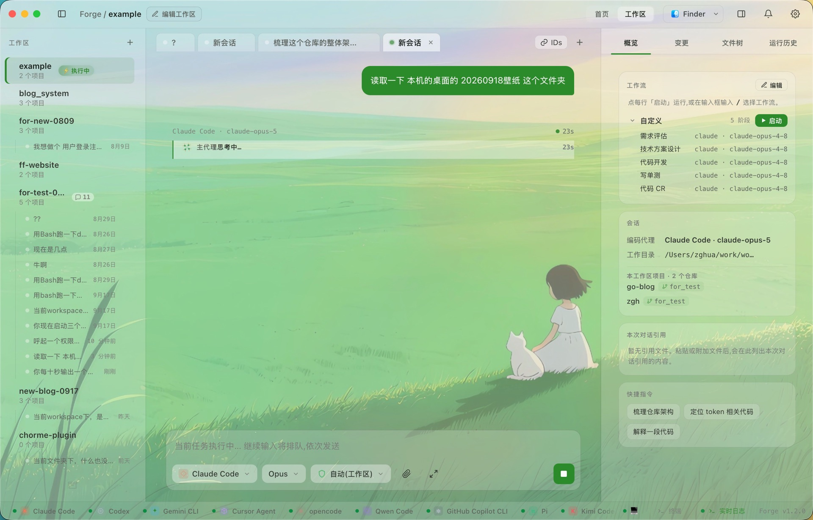
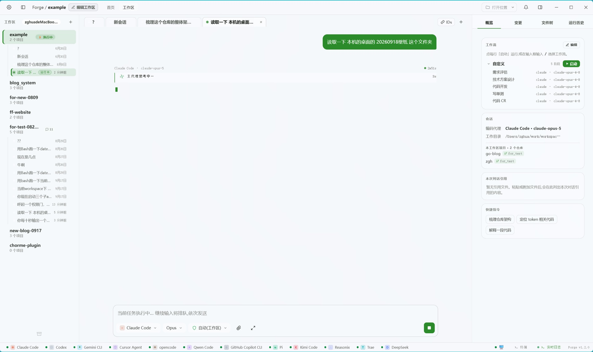
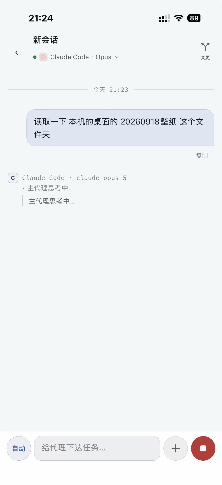
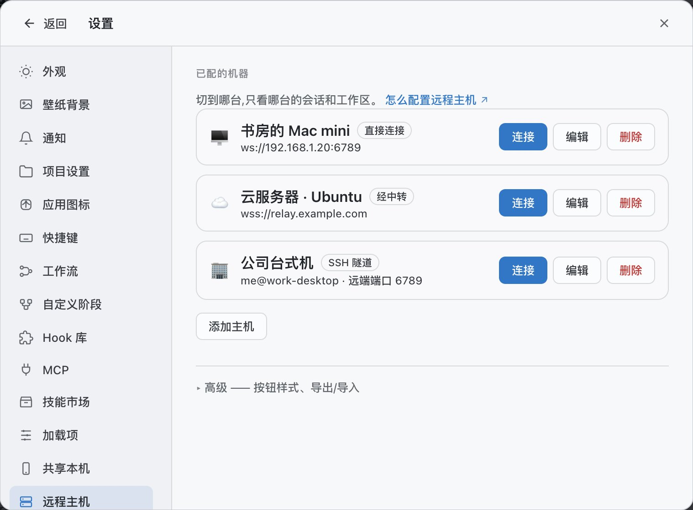
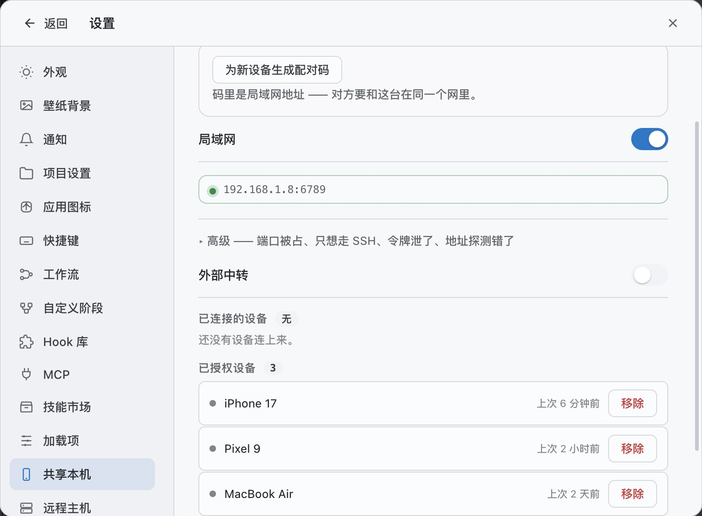

<div align="center">


# myFlowForge

**하나의 GUI로 네이티브 Claude Code, Codex, Cursor 등의 agent를 연결합니다. 한곳에서 관리하고, 여러 기기에서 연결합니다.**

myFlowForge는 로컬에 설치된 공식 CLI(Claude Code, Codex, Cursor, Gemini, qoder, opencode, DeepSeek 등)를 직접 호출하며, agent 자체를 수정하거나 대체하지 않고 그 위에 통합된 GUI만 제공합니다. 같은 세션 안에서의 agent 및 모델 전환, 네이티브 세션 가져오기, 단계별 워크플로 실행, Codex 네이티브 펫 호환을 지원하며, 다른 컴퓨터, 서버 또는 휴대폰에서 원격으로 접속할 수 있습니다.

[](LICENSE)


[简体中文](README.md) · [English](README.en.md) · [日本語](README.ja.md) · **한국어** · [Español](README.es.md) · [Français](README.fr.md) · [Deutsch](README.de.md)

</div>

---

<div align="center">


<sub><b>홈</b>: 워크스페이스, 실행 중인 agent, 오늘의 변경 사항. 배경화면, 스킨, 강조색은 모두 사용자 지정할 수 있습니다.</sub>

</div>

---

## 프로젝트 소개

각 AI 코딩 CLI는 서로 독립된 터미널에서 실행되며, 세션, 사용 한도, 설정이 서로 공유되지 않습니다. 그 결과 하나의 작업이 특정 도구 하나에 묶이는 경우가 많습니다.

myFlowForge는 이러한 CLI 위에 놓이는 GUI 계층으로, 다음 세 가지 원칙을 따릅니다.

- **네이티브 연결**: 공식 CLI를 통해 agent를 호출하며, 사용자 본인의 계정, 구독, 로컬 설정을 그대로 사용합니다. agent를 fork하거나 수정하지 않고, API key를 저장하지 않으며, 어떤 요청도 프록시하지 않습니다. agent가 업그레이드되면 새 기능을 바로 사용할 수 있습니다.
- **통합 관리**: 여러 agent, 여러 프로젝트, 여러 세션을 하나의 화면에서 관리하므로, 작업이 더 이상 단일 도구에 묶이지 않습니다.
- **다중 기기 연결**: 데스크톱, 헤드리스 Linux daemon, iOS / Android 클라이언트가 동일한 워크스페이스와 세션을 공유하며, LAN 직접 연결, SSH, 종단 간 암호화 중계를 지원합니다.

> **프로젝트 상태:** 개인이 유지 관리하며 지속적으로 개발 중입니다. macOS, Windows, Linux 설치 패키지와 Android APK, iOS TestFlight를 제공합니다. macOS 패키지는 Developer ID 서명과 Apple 공증을 거쳤고, Android 패키지는 정식 키로 서명되어 있으며, Windows 패키지는 아직 서명되지 않았습니다.

## 핵심 기능

### 1. 네이티브 agent 연결

14개의 코딩 CLI를 지원합니다: **Claude Code · Codex · Cursor · Gemini · qoder · opencode · Qwen · Copilot · Pi · Kimi · Reasonix · Trae · Antigravity · DeepSeek**.

myFlowForge가 구동하는 것은 로컬에 설치되어 로그인된 공식 CLI이며, 그 동작을 변경하지 않습니다. 모델 목록은 각 CLI의 로컬 설정에서 우선 읽어 오며, 읽을 수 없는 경우 사전 정의 목록을 사용합니다. 수동으로 추가할 수도 있으며, 수동으로 추가한 모델은 새로 고침으로 덮어쓰이지 않습니다. 설치되지 않았거나 로그인되지 않은 CLI는 설정에 표시되며 설치 안내가 함께 제공됩니다.

### 2. 같은 세션 안에서 agent와 모델 전환

agent, 모델, 권한 모드는 매 대화 턴 전에 다시 선택할 수 있으며, 컨텍스트는 연속적으로 유지됩니다.

- 어떤 모델의 결과가 만족스럽지 않으면 다른 모델로 바꿔 계속할 수 있으며, 새 모델은 이전의 모든 대화를 볼 수 있습니다.
- 한 제공사의 사용 한도가 소진되면 새 세션을 열 필요 없이 다른 제공사로 전환할 수 있습니다.
- 작업 성격에 따라 모델을 배분할 수 있습니다. 예를 들어 설계에는 성능이 더 높은 모델을, 구현과 마무리에는 비용이 더 낮은 모델을 사용할 수 있습니다.

네이티브 이어하기를 지원하는 agent(Claude Code, Codex, Cursor, qoder, opencode, Antigravity)는 자체 세션 기록을 그대로 사용하고, 그 외의 agent는 myFlowForge가 컨텍스트를 재구성합니다.

### 3. 다중 기기 연결

- **원격 호스트**: 데스크톱에서 다른 컴퓨터나 서버에 연결하여 해당 머신의 agent, 저장소, 터미널을 구동할 수 있습니다. 현재 호스트는 상태 표시줄에서 전환하며, 워크스페이스, 세션, git 변경 사항, 내장 터미널이 함께 전환됩니다.
- **세 가지 연결 방식**: LAN 직접 연결, SSH, 종단 간 암호화 중계. 중계는 암호문만 전달하므로 세션 내용을 읽을 수 없으며, 직접 배포할 수 있습니다(Node 또는 Cloudflare Worker).
- **헤드리스 daemon**: Linux 서버에서 `myflowforge-daemon`을 실행하면, `pair` 명령이 터미널에 페어링용 QR 코드를 출력합니다.
- **모바일**: iOS와 Android 클라이언트에서 실시간 대화 보기, 권한 확인 및 설계 승인 처리, 변경 사항과 diff 보기, 워크스페이스 생성, 워크플로 편집, 호스트 전환을 지원합니다.
- **기기 권한 부여**: 기기마다 별도의 페어링 코드를 사용하며, 언제든 개별적으로 제거할 수 있고 해제는 즉시 적용됩니다.


<table>
<tr>
<td width="40%"></td>
<td width="40%"></td>
<td width="20%"></td>
</tr>
</table>
<p align="center"><sub>하나의 세션을 macOS·Windows·iPhone에서 동기화</sub></p>

<table>
<tr>
<td width="50%"></td>
<td width="50%"></td>
</tr>
<tr>
<td align="center"><sub>원격 호스트: LAN 직접 연결·릴레이·SSH</sub></td>
<td align="center"><sub>호스트 공유: 기기별로 인증하며 개별 삭제 가능</sub></td>
</tr>
</table>

### 4. 네이티브 세션 가져오기

로컬의 Claude Code, Codex, Cursor, qoder 세션 기록을 읽기 전용으로 스캔하여 워크스페이스로 가져오면 바로 대화를 이어 갈 수 있으며, 기존 데이터에는 영향을 주지 않습니다.

### 5. 단계별 워크플로

일반 대화 외에도 작업을 단계별로 실행할 수 있습니다. 워크플로를 시작하면 대화가 단계 모드로 전환됩니다.

- 상단에 현재 진행 상황(N단계 / 전체 M단계), 현재 단계, 담당 agent가 표시됩니다.
- 단계 내의 agent는 현재 대화 안에서 작업하며, 출력, 도구 호출, 파일 변경이 모두 표시됩니다.
- 각 단계가 끝나면 "다음"을 확인해야 다음 단계로 넘어가며, 추가 질문이나 수정 요청은 재실행을 유발하지 않습니다.
- 설계 단계는 완전한 markdown 문서(`forge-docs/design.md`)를 산출하며, 이 문서는 하위 agent들이 공통으로 따르는 계약이 됩니다.
- 승인이 설정된 단계에서는 **승인**, **반려**(코멘트를 첨부하여 재작업) 또는 **질문**을 할 수 있으며, 이전 단계로 되돌아갈 수도 있습니다.

단계마다 agent, 모델, 권한 모드를 개별적으로 지정할 수 있습니다. 워크플로와 단계는 모두 사용자 정의하여 저장하고 재사용할 수 있습니다.

### 6. 다중 프로젝트 병렬 작업

하나의 워크스페이스에 여러 저장소를 포함할 수 있습니다. 단계는 **프로젝트별로 팬아웃**할 수 있습니다. 프런트엔드, 백엔드, SDK를 각자의 agent가 독립된 git worktree에서 병렬로 개발하며, 모든 변경 사항은 하나의 변경 패널에 모여 검토됩니다. 팬아웃 범위는 일부 저장소만 선택할 수도 있습니다.

### 7. 단계 Hook

Hook은 단계 사이에 삽입되는 보조 단계로, **실행 전**, **특정 단계 후** 또는 **실행 후**에 연결할 수 있으며, 코드 가져오기, 문서 동기화, lint 실행, 보드 업데이트, 알림 전송 등에 사용합니다.

각 Hook은 제한된 하위 agent로서 워크스페이스 루트 디렉터리에서 실행되며, 할당된 스킬과 도구만 사용할 수 있습니다. 실행이 실패하면 파이프라인이 일시 중지되며, 재시도, 건너뛰기 또는 중단을 선택할 수 있습니다. Hook은 전역 라이브러리에 저장되어 어떤 워크플로에서든 재사용할 수 있습니다.

### 8. 데스크톱 펫

데스크톱 펫은 현재 화면을 따라다니며 agent의 실행 상태를 실시간으로 반영하고, 확인 카드를 바로 띄울 수 있습니다. **Codex 네이티브 펫과 호환**되어 codex-pets.net 펫 마켓에서 설치할 수 있으며, 사용자 지정 이미지도 지원합니다. 이 밖에 사용 시간에 따라 점차 성장하는 성장형 펫도 있습니다.

---

<div align="center">


<sub><b>단계 구성</b>: 다섯 단계에 각각 agent와 모델을 지정하며, <i>개발</i> 단계는 두 저장소로 팬아웃합니다.</sub>

</div>

---

## 지원하는 agent

| Agent | 대화 | 워크플로 | 네이티브 이어하기 | MCP | 모델 |
|------|:----:|:------:|:--------:|:---:|------|
| **Claude Code** | ✅ | ✅ | ✅ | ✅ | CLI에서 읽기 |
| **Codex** | ✅ | ✅ | ✅ | ✅ | CLI에서 읽기 |
| **Cursor** | ✅ | ✅ | ✅ | ✅ | CLI에서 읽기 |
| **qoder** | ✅ | ✅ | ✅ | ✅ | 읽기 + 사용자 정의 |
| **opencode** | ✅ | ✅ | ✅ | ✅ | 다중 벤더 게이트웨이 |
| **Gemini** | ✅ | ✅ | — | ✅ | 사전 정의 목록 |
| **Qwen** | ✅ | ✅ | — | ✅ | 사전 정의 목록 |
| **Copilot** | ✅ | ✅ | — | ✅ | 사전 정의 목록 |
| **Pi** | ✅ | ✅ | — | — | 계정 기본값 / 사용자 정의 |
| **Kimi** | ✅ | ✅ | — | — | kimi-k2.5 · 256K |
| **Reasonix** | ✅ | ✅ | — | — | deepseek-flash / reasoner |
| **Trae** | ✅ | ✅ | — | — | 계정 기본값(`/model` 또는 `trae_cli.yaml`) |
| **Antigravity** | ✅ | ✅ | ✅ | — | `agy models`로 갱신 |
| **DeepSeek** | ✅ | ✅ | — | — | 계정 기본값 |

> **DeepSeek**은 DeepSeek Harness(`npm install -g @deepseek-ai/dsh`)를 가리킵니다. myFlowForge는 그 `headless` profile을 사용하며, 세 가지 권한 모드는 각각 `read-only` / `workspace-write` / `danger-full-access`에 대응합니다. API key는 `dsh web`(Models 페이지) 또는 환경 변수 `DEEPSEEK_API_KEY`로 설정할 수 있습니다.
>
> **Trae**(ByteDance TraeCode CLI)는 npm으로 배포되지 않으므로, 공식 `install.sh`를 통해 `~/.local/bin`에 설치하고 PATH에 추가해야 합니다. 워크플로에서 사람의 개입 없이 파일을 수정하게 하려면 `traecli config edit`을 실행하여 `permission_mode: bypass_permissions`를 설정하십시오.

## 워크플로 실행 흐름

```
    목표 설명
        │
        ▼
   ┌─ hook ──┐  ┌─ hook ──┐                                   ┌─ hook ──┐
   │ 실행 전 │  │ 설계 후 │                                   │ 실행 후 │
   └───┬─────┘  └───┬─────┘                                   └───┬─────┘
       ▼            ▼                                             ▼
   요구사항 ───→  설계 ───→  승인 ───→  개발 ───→  테스트 ───→  리뷰
   (명확화)    (design.md)  (수동)    (팬아웃)     (검증)     (다각도)
                    │                     │
                    │                     └─ 프로젝트마다 agent 하나,
                    │                        병렬 실행, 독립 worktree
                    └─ 전체 문서, 모든 하위 agent가 전문을 읽음

 각 단계 사이마다 "다음" 확인이 필요합니다. 단계는 추가, 삭제, 재정렬하거나
 건너뛸 수 있으며, 예를 들어 "요구사항 → 개발"만 실행할 수도 있습니다.
```

워크플로는 세 가지 방법으로 시작할 수 있습니다.

1. 워크플로 패널에서 **시작**을 클릭합니다.
2. 입력창에 `/`를 입력하여 워크플로를 선택합니다.
3. 개발 작업을 자연어로 바로 설명하면, 메인 agent가 이를 인식하여 MCP를 통해 설계 승인을 요청합니다. 일반적인 질문, 논의, 작은 수정에는 트리거되지 않습니다.

## 원격 호스트와 모바일

| 방식 | 설명 |
|---|---|
| **직접 연결** | 같은 LAN 안에서 daemon 포트에 직접 연결하며, 토큰으로 인증합니다. |
| **SSH** | 기존 SSH 로그인을 재사용하며, 추가 포트를 열 필요가 없습니다. |
| **중계** | 두 머신이 직접 통신할 수 없는 경우에 사용합니다. **종단 간 암호화**: 세션마다 새 키를 협상하며, 중계는 암호문만 전달하고 복호화할 수 없는 프레임은 모두 폐기합니다. 직접 배포할 수 있으며(`relay/`, Node 및 Cloudflare Worker 지원), 절차는 `relay/README.md`를 참조하십시오. |

**Linux daemon**은 데스크톱과 같은 코드베이스에서 창 부분을 제거한 것입니다. tar.gz를 설치한 뒤 systemd로 실행하고, 터미널에 출력된 QR 코드를 스캔하면 페어링이 완료됩니다(`docs/linux-deploy.md` 참조).

**모바일**은 컴퓨터를 떠나 있을 때 자주 쓰는 작업을 지원합니다. 실시간 대화(사고 과정, 도구 호출, 하위 agent 카드 포함), 권한 확인과 설계 승인, 변경된 파일과 diff, 워크스페이스 생성, 워크플로 템플릿, 호스트 전환과 QR 코드 페어링을 제공합니다. markdown, 표, 로컬 이미지는 네이티브로 렌더링하며, 개인 정보 보호를 위해 원격 이미지 주소는 링크로 남겨 두고 자동으로 불러오지 않습니다.

## 기타 기능

- **MCP 브리지**: 내장된 Forge MCP 서버를 통해 agent가 앱을 호출할 수 있습니다: `forge_ask`, `forge_propose_plan`, `forge_write_artifact`, `forge_handoff`, `forge_delegate`, `forge_read_context`, `forge_heartbeat`. MCP를 지원하는 agent에는 자동으로 주입되며, 그 외에는 텍스트 지시로 대체됩니다.
- **MCP 서버와 스킬 마켓**: 각 CLI에 설정된 MCP 서버를 확인하고 앱 안에서 인증할 수 있으며, 스킬 마켓에서 해당 CLI용 스킬을 설치할 수 있습니다.
- **메모리**: 워크스페이스별로 노트를 저장하며 agent가 읽을 수 있어, 장기 작업에서 컨텍스트를 이어 가기 쉽습니다.
- **실행 관측**: 사고 과정, 도구 호출, 파일 변경, 원시 출력을 스트리밍으로 표시하며, 필터링 가능한 로그, 실행 기록, 프로젝트 간 변경 기록을 제공합니다.
- **사용 한도와 사용량**: 각 제공사의 남은 한도와 초기화 시간, 그리고 워크스페이스, agent, 날짜별 사용량 통계를 제공합니다.
- **봇 브리지**: DingTalk, Telegram 또는 Feishu에서 승인 처리, 결과 확인, 대화 시작, 워크플로 구동을 할 수 있습니다.
- **권한 모드**: 읽기 전용 검토, 자동(워크스페이스, 기본값), 전체 접근. 세션별 또는 단계별로 설정할 수 있으며, 각 CLI의 실제 샌드박스 범위에 대응됩니다.
- **슬래시 명령과 스킬**: `/`를 입력하면 로컬에 실제로 존재하는 명령과 설치된 스킬이 나열되며, agent별로 필터링됩니다.
- **파일 탐색과 diff**: 전체 화면 파일 트리와 변경 표시, 구문 강조 미리보기, diff와 전체 파일 보기 전환을 지원합니다.
- **내장 터미널**: 실제 pty로 워크스페이스를 루트 디렉터리로 사용하며, provider별로 프록시와 시간대를 설정할 수 있습니다. 원격 호스트에 연결하면 터미널은 원격 머신에서 실행됩니다.
- **외관**: 오리지널 스킨 6종, 강조색 12종, 300장이 넘는 배경화면을 제공하며 사용자 지정 이미지를 지원합니다. 앱과 대화 영역의 글자 크기를 따로 설정할 수 있고, 배경화면에서 배색을 자동 생성할 수 있으며, macOS 네이티브 반투명 재질을 지원합니다.
- **대화 내 이미지와 시각화**: agent가 생성한 로컬 이미지가 응답 안에 바로 표시됩니다. 응답의 HTML 조각은 카드, 표, 도식으로 렌더링할 수 있습니다(기본값은 꺼짐, 화이트리스트 기반으로 재구성하며 `innerHTML`은 사용하지 않음).

## 다운로드와 설치

[**Releases**](https://github.com/flowForges/myFlowForge/releases) 페이지에서 최신 버전을 다운로드하십시오.

| 플랫폼 | 파일 |
|------|------|
| macOS · Apple Silicon(M1–M4) | `myFlowForge-<버전>-arm64.dmg` |
| macOS · Intel | `myFlowForge-<버전>.dmg` |
| Windows · x64 | `myFlowForge-<버전>-x64-setup.exe` |
| Windows · ARM | `myFlowForge-<버전>-arm64-setup.exe` |
| Android | `myFlowForge-<버전>.apk` |
| Linux · 헤드리스 daemon | `myFlowForge-daemon-<버전>-linux.tar.gz` |
| iOS | TestFlight(초대제) |

> **macOS** 설치 패키지는 서명 및 공증되어 있어 바로 설치할 수 있습니다.
> **Windows** 설치 패키지는 아직 서명되지 않았으므로, SmartScreen 경고가 표시되면 "추가 정보 → 실행"을 선택하십시오.
>
> 앱에는 업데이트 확인 기능이 내장되어 있어, 새 버전이 출시되면 앱 안에서 알려 줍니다.

**iOS**는 현재 TestFlight(초대제)로 배포되며, `mobile/` 디렉터리에서 본인의 Apple ID로 직접 빌드하여 설치할 수도 있습니다.

## 빠른 시작

**요구 사항:** macOS 11+ / Windows 10+ / 주요 Linux 배포판, Node.js ≥ 20, git, 그리고 설치 및 로그인이 완료된 코딩 CLI 하나 이상.

```bash
git clone https://github.com/flowForges/myFlowForge.git
cd myFlowForge
npm install
npm run dev          # 개발 모드, 렌더러 핫 리로드
```

| 명령 | 설명 |
|------|------|
| `npm run dev` | 개발 모드로 시작(핫 리로드) |
| `npm test` | 전체 테스트 스위트 실행(Vitest) |
| `npm run typecheck` | 메인 프로세스와 렌더러의 두 tsconfig 검사 |
| `npm run build` | 프로덕션 빌드 |
| `npm run dist:mac-all` | Intel과 Apple Silicon용 `.dmg`를 함께 패키징 |
| `npm run dist:win` | Windows x64 설치 프로그램 패키징 |
| `npm run check:daemon` | 헤드리스 daemon 종단 간 검증 |

모바일은 `mobile/`(Expo / React Native)에, 중계 서비스는 `relay/`에 있으며, 각각 독립된 `package.json`을 가집니다.

빌드 결과물은 `release/`에 출력됩니다. `src/main/**`를 수정한 후에는 Electron을 완전히 재시작해야 하며, 핫 리로드는 렌더러에만 적용됩니다.

## 기술 스택

| 분류 | 기술 |
|------|------|
| 데스크톱 셸 | [Electron](https://www.electronjs.org/) 42 · [electron-vite](https://electron-vite.org/) |
| 인터페이스 | [React](https://react.dev/) 19 · TypeScript 6 |
| 모바일 | [Expo](https://expo.dev/) · [React Native](https://reactnative.dev/) |
| 터미널 | [xterm.js](https://xtermjs.org/) · [node-pty](https://github.com/microsoft/node-pty) |
| Agent 브리지 | [Model Context Protocol SDK](https://modelcontextprotocol.io/) |
| 프로세스 제어 | [execa](https://github.com/sindresorhus/execa) |
| 데이터 검증 | [zod](https://zod.dev/) |
| 파일 감시 | [chokidar](https://github.com/paulmillr/chokidar) |
| 테스트 | [Vitest](https://vitest.dev/) · Testing Library |
| 패키징 | [electron-builder](https://www.electron.build/) |

## 프로젝트 구조

```
src/
├── main/              # Electron 메인 프로세스
│   ├── agents/        # CLI 어댑터, provider 레지스트리, 탐지와 권한
│   ├── run/           # 워크플로 엔진: 단계, 승인, 팬아웃, hook, 인계
│   ├── chat/          # 워크스페이스 대화, 큐와 메모리
│   ├── mcp/           # Forge MCP 서버(agent → 앱 브리지)
│   ├── remote/        # 원격 호스트: 직접 연결 / SSH / 중계, 라우팅, 종단 간 암호화 채널
│   ├── daemon/        # 헤드리스 daemon과 터미널 QR 코드 페어링
│   ├── bot/           # 봇 브리지(DingTalk / Telegram / Feishu)
│   ├── plugins/       # 플러그인 호스트, 카탈로그, 스케줄링과 확장 지점
│   ├── sessionImport/ # 네이티브 세션 스캔과 가져오기
│   ├── usage/         # 제공사별 사용 한도 어댑터
│   ├── pet/           # 데스크톱 펫 창
│   └── ...            # git, 파일 시스템, 터미널, 업데이트, 감시, 창, 외관
├── renderer/          # React 인터페이스(뷰, 컴포넌트, 설정, 테마, 펫)
├── preload/           # 컨텍스트 격리된 IPC 브리지
└── shared/            # 프로세스 간 공유 타입과 순수 로직
mobile/                # iOS와 Android 클라이언트(Expo / React Native)
relay/                 # 종단 간 암호화 중계(Node 또는 Cloudflare Worker)
```

## 기여하기

issue와 PR을 환영합니다. 이 프로젝트는 테스트 주도 개발을 따르므로, 변경 사항을 제출할 때는 해당 테스트를 함께 추가하거나 업데이트하고 `npm test`와 `npm run typecheck`가 통과하는지 확인하십시오.

## 라이선스

[MIT License](LICENSE) © 2026 zghua

## 감사의 말

Electron, React, Vite, Model Context Protocol 등의 오픈 소스 프로젝트와, 이 프로젝트가 연결하는 각 코딩 agent에 감사드립니다.

## 관련 링크

- [LINUX DO](https://linux.do/latest): 개발자 커뮤니티
- [V2EX](https://www.v2ex.com/): 크리에이티브 워커 커뮤니티
